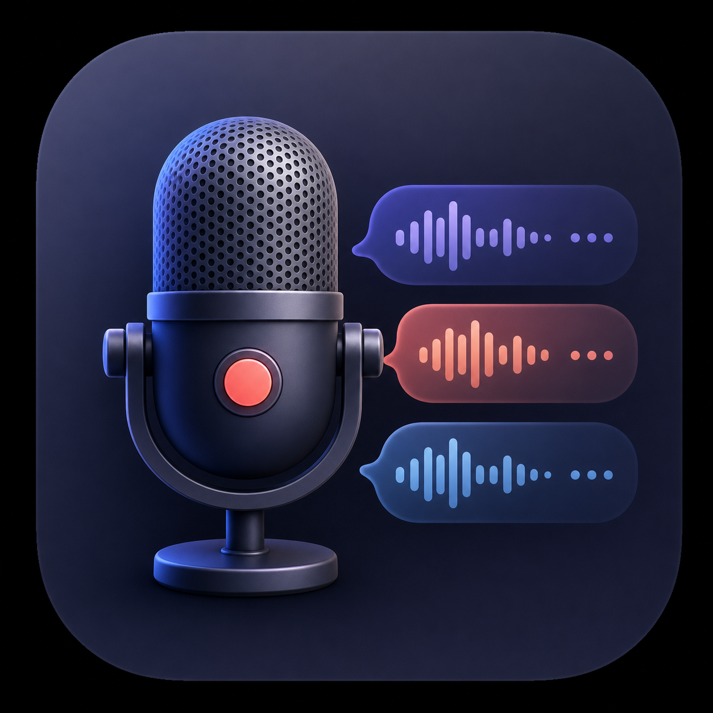
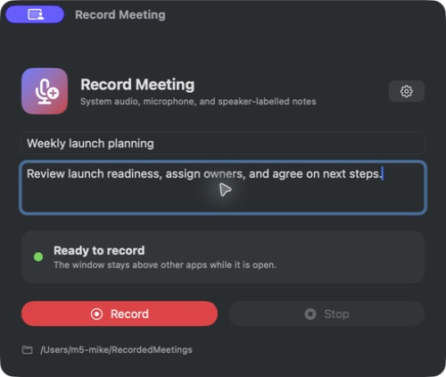
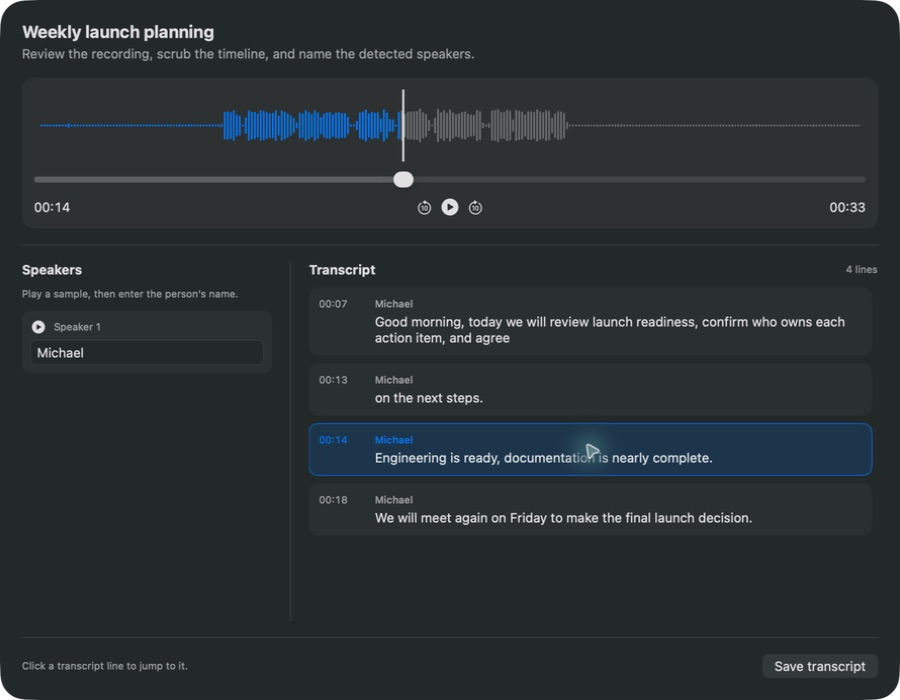

#  record-meeting

Records an online meeting and gives you a transcript with names on it

macOS

<!-- media: hero -->
<!--  -->
<!-- /media: hero -->

## What it is

A small always-on-top window that records both the meeting audio coming out of the Mac and your microphone. When you stop, it saves an MP3, transcribes it locally, works out who the different speakers are and asks you to name each one.

Afterwards you get a review screen where you can play the recording and click any transcript line to jump to it. It can also add each meeting as a page in a Notion database if you like.

## Get it

Paste this into your AI coding agent (Claude Code, Codex, Cursor...):

> Clone https://github.com/mikecann/record-meeting and make it my own. It's one of Mike
> Cann's personal tools, so read the README first, change anything specific to his
> setup to suit mine, then help me get it running.

### Or set it up by hand

You'll need:

- macOS 15 or newer
- Xcode or the Xcode Command Line Tools (Swift 6 or newer)
- Python 3 with `venv` and `pip`
- `ffmpeg` on `PATH`, in `~/.local/bin`, or installed with Homebrew
- A Hugging Face token with access accepted for
  [`pyannote/speaker-diarization-community-1`](https://huggingface.co/pyannote/speaker-diarization-community-1)
- Optional: a Notion integration token with insert-content access

```bash
git clone https://github.com/mikecann/record-meeting.git
cd record-meeting
bash setup_mac.sh
bash install.sh
record-meeting
```

`setup_mac.sh` creates a dedicated Python environment under
`~/Library/Application Support/Record Meeting`, installs the transcription and
speaker-detection packages, builds the native app, and stages it at
`~/Applications/Record Meeting.app`. It installs ffmpeg through Homebrew if
ffmpeg is missing and Homebrew is available.

`install.sh` links the command into `~/.local/bin`. If that directory isn't on
`PATH`, add `export PATH="$HOME/.local/bin:$PATH"` to `~/.zshrc` and open a new
terminal. You can choose another directory with `bash install.sh /path/to/bin`.
Re-run the installer if you move the clone.

Open Preferences using the gear button and add your Hugging Face token. Add
Notion details there too if you want to publish meetings. Tokens are stored in
macOS Keychain, so you don't need a `.env` file.

macOS will ask for:

- **Screen & System Audio Recording**, for the remote side of a meeting
- **Microphone**, for your side of a meeting

## Using it

1. Open `record-meeting` or launch **Record Meeting** from Spotlight.
2. Enter a meeting title and description if you want, then click **Record**.
3. Click **Stop** when you're done. The first transcription downloads its models.
4. Listen to the voice samples and name each speaker.
5. In the review screen, play or scrub the audio, or click a transcript line to
   jump to it. The current line highlights and scrolls into view during playback.

Always test the first recording with headphones. Speaker playback can otherwise
feed back into the microphone and produce an echo in the saved MP3.

```bash
record-meeting restart   # Rebuild the signed app and open it
record-meeting stop      # Stop the app
record-meeting setup     # Install or update dependencies and rebuild
```

## Screenshots





## Preferences

The default output directory is `~/RecordedMeetings`. Preferences let you
choose another directory, select a Whisper model, and configure Hugging Face
and Notion.

Tokens are stored in macOS Keychain. The other settings use `UserDefaults`.

### Notion setup

1. Create a Notion integration and give it **Insert content** capability.
2. Create or choose a normal Notion page that will contain the database.
3. Share that parent page with the integration.
4. In Record Meeting Preferences, paste the integration token and parent page
   URL.
5. Click **Create database**.

The app creates one database named **Recorded Meetings**, stores its data-source
ID, then creates one page per completed meeting. The page contains meeting
metadata and the full speaker-labelled transcript. The MP3 stays local; Notion
gets its local file path rather than uploading the audio.

If you already have a compatible database, paste its data-source ID instead.
Its properties must be named `Name`, `Started`, `Duration`, `Speakers`,
`Description`, `Audio file`, and `Transcript file`.

## Output

For a meeting named `Weekly planning`, Record Meeting writes:

```text
2026-07-24-143000-weekly-planning.mp3
2026-07-24-143000-weekly-planning.transcript.json
2026-07-24-143000-weekly-planning.transcript.md
2026-07-24-143000-weekly-planning.metadata.json
2026-07-24-143000-weekly-planning.sample-SPEAKER_00.mp3
```

The `.sample-*` clips are the short voice examples played by the speaker-naming
dialog. A hidden temporary `.mov` is used only while recording and is removed
after the MP3 and transcript JSON are safely written. If processing fails, that
temporary file is deliberately kept for recovery.

## Development

```bash
swift test
python3 -m unittest discover -s tests -p 'test_*.py' -v
bash restart.sh
```

After changing Swift code, use `restart.sh` so the signed app bundle remains
the process macOS associates with privacy permissions. The tests cover file
naming, preferences, transcript timing and formatting, Notion payloads, audio
mixing and launcher installation. They don't need models, API keys or recording
permissions. CI runs these checks on macOS.

`Sources/RecordMeetingApp/` contains the SwiftUI app.
`record_meeting_processor.py` is copied into the app bundle by `build-app.sh`.
The processor uses the dedicated Python environment created by `setup_mac.sh`.

For a separate development bundle, set `RECORD_MEETING_APP_DIR` when running
`build-app.sh`, `restart.sh` or the launcher. `RECORD_MEETING_CODESIGN_IDENTITY`
can select a signing identity; `-` uses ad-hoc signing. The build script uses an
available Apple Development identity by default, falling back to ad-hoc signing.

## Troubleshooting

If transcription dependencies are missing, run `bash setup_mac.sh` again.
For speaker detection errors, check your token and model access on Hugging Face.
A failed processing run keeps its temporary capture so you can recover the audio.

If recording permissions stop working after a rebuild, check **System Settings >
Privacy & Security** for Microphone and Screen & System Audio Recording access,
then relaunch the signed app with `bash restart.sh`.

## More tools

You can find my other tools at [mikerosoft.app](https://mikerosoft.app).

MIT licensed.
